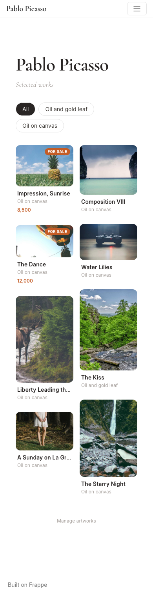
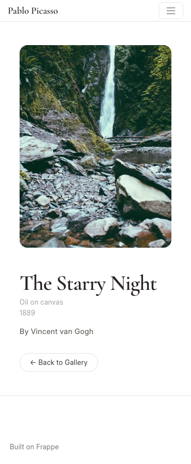
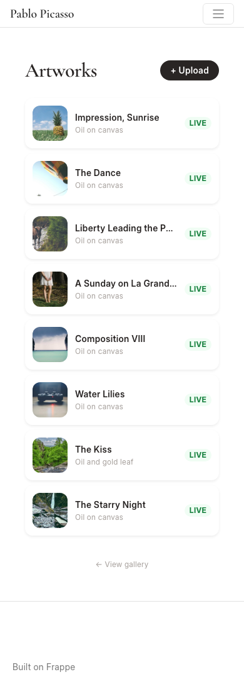
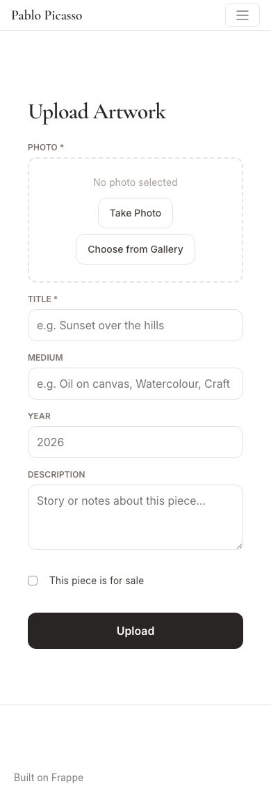
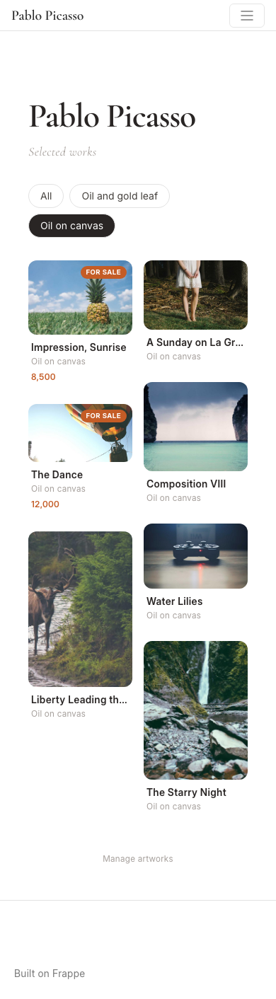

# Artpage

A personal art portfolio built on Frappe Framework. Upload and showcase paintings, watercolours, sketches, art & craft — fully mobile-friendly, managed entirely from your phone. The artist's name appears as the gallery headline and in the navbar on every page, driven by a single setting.

---

## Screenshots

| Gallery (masonry) | Artwork Detail | Mobile |
|-------------------|----------------|--------|
|  |  |  |

| Manage | Upload | Filter Active |
|--------|--------|---------------|
|  |  |  |

> Curated screenshots live in `docs/screenshots/`, not regenerated on every test run. If you change `/gallery`, `/upload`, `/manage`, or `/edit-artwork`, re-run `docs/take_screenshots.py` and review the diffs before committing.

---

## Features

- **Artist identity** — name shown as the gallery headline and in the navbar on every page; change it once in Website Settings, updates everywhere
- **Public gallery** — masonry grid (2–4 columns), images at natural proportions, filter by medium, tap to open detail
- **Artwork detail** — full-width image, Cormorant Garamond serif title, medium, year, description, price
- **Mobile upload** — takes a photo from the camera or gallery; title, medium, year, description, for-sale price
- **Edit & delete** — change any field, replace the image, toggle published/draft, or delete
- **Manage list** — overview of all artworks (published + draft) with live/draft status badge
- **Guest protection** — upload/edit/manage require login; gallery is fully public

---

## Pages

| URL | Access | Purpose |
|-----|--------|---------|
| `/gallery` | Public | Browse published artworks |
| `/artwork?name=ART-0001` | Public | Full artwork detail |
| `/manage` | Artist | List all artworks |
| `/upload` | Artist | Upload a new artwork |
| `/edit-artwork?name=ART-0001` | Artist | Edit or delete an artwork |

---

## Installation

### Prerequisites

- Frappe bench (v15+)
- MariaDB
- Redis

### Steps

```bash
# 1. Create site
bench new-site artpage.localhost --admin-password admin

# 2. Install app
bench --site artpage.localhost install-app artpage

# 3. Build assets
bench build --app artpage

# 4. Start the server
bench start
```

Then open `http://artpage.localhost:8005/gallery`.

---

## Usage

### As a visitor

Open `/gallery` — no login required. Tap a card to see the full artwork.

### Set your name

Go to **Frappe desk → Website → Website Settings** and set **App Name** to your name. It appears as the gallery headline and in the top-left navbar on every page instantly.

### As the artist

1. Open `/login` → log in as `Administrator`
2. Go to `/manage` — your home base (bookmark this on your phone)
3. Tap **+ Upload** to add a new artwork
4. Tap any artwork in the manage list to edit or delete it

---

## Artwork fields

| Field | Type | Notes |
|-------|------|-------|
| Title | Text | Required |
| Image | Image | Required — take a photo or choose from gallery on mobile |
| Medium | Text | e.g. Oil on canvas, Watercolour, Craft |
| Year | Integer | Year the piece was created |
| Description | Text | Story or notes |
| For Sale | Checkbox | Shows a "For Sale" badge on cards |
| Price | Currency | Informational — shown when For Sale is checked |
| Published | Checkbox | Controls gallery visibility (default: on) |

---

## Testing

### Unit & integration tests (Frappe)

Tests run in a dedicated test site with full DB rollback between each test.

```bash
# Create test site (once)
bench new-site artpage-test.localhost --admin-password admin
bench --site artpage-test.localhost install-app artpage

# Run all tests
bench --site artpage-test.localhost run-tests --app artpage -v

# Run specific test module
bench --site artpage-test.localhost run-tests \
  --module artpage.artpage.doctype.artwork.test_artwork -v

# Run portal page tests
bench --site artpage-test.localhost run-tests \
  --module artpage.tests.test_portal -v

# Run API/permission tests
bench --site artpage-test.localhost run-tests \
  --module artpage.tests.test_api -v
```

Test files:
- `artpage/artpage/doctype/artwork/test_artwork.py` — DocType unit tests (14 tests)
- `artpage/tests/test_portal.py` — Portal page context tests (15 tests)
- `artpage/tests/test_api.py` — Permission & query tests (10 tests)

### UI tests (Playwright)

Browser-based tests against the live dev site. Screenshots are saved to `ui_tests/screenshots/` (gitignored, debugging aid only — not the README images).

```bash
# One-time browser install
/path/to/benches/b2/env/bin/playwright install chromium

# Make sure artpage.localhost resolves (add to /etc/hosts if needed)
# 127.0.0.1  artpage.localhost

# Start server (in a separate terminal)
bench start

# Run UI tests from apps/artpage/
cd /path/to/benches/b2/apps/artpage
/path/to/benches/b2/env/bin/pytest ui_tests/ -v \
  --base-url http://artpage.localhost:8005

# Run a specific test file
/path/to/benches/b2/env/bin/pytest ui_tests/test_gallery.py -v

# Run with headed browser (watch tests execute live)
/path/to/benches/b2/env/bin/pytest ui_tests/ -v --headed
```

UI test files:
- `ui_tests/test_gallery.py` — Gallery page (7 tests)
- `ui_tests/test_detail.py` — Artwork detail page (4 tests)
- `ui_tests/test_upload.py` — Upload, edit, manage pages (9 tests)

---

## Project structure

```
artpage/
  artpage/
    artpage/
      doctype/
        artwork/
          artwork.json        # DocType definition
          artwork.py          # Controller
          test_artwork.py     # Unit tests
    tests/
      test_portal.py          # Portal page context tests
      test_api.py             # Permission & query tests
    www/
      gallery.html / .py      # Public gallery
      artwork.html / .py      # Artwork detail
      upload.html / .py       # Upload form (auth-gated)
      edit-artwork.html / .py # Edit/delete form (auth-gated)
      manage.html / .py       # Manage list (auth-gated)
    templates/
      includes/
        navbar/
          navbar.html         # Overrides Frappe navbar to show artist name
    public/
      css/artpage.css         # Google Fonts import + navbar brand style
  ui_tests/
    conftest.py               # Playwright config & fixtures
    test_gallery.py
    test_detail.py
    test_upload.py
    screenshots/              # Auto-generated by test runs (gitignored)
  docs/
    take_screenshots.py       # Regenerates the screenshots below (run by hand)
    screenshots/              # Curated README images
```

---

## Tech stack

- **Backend**: Frappe Framework (Python, Jinja2, MariaDB)
- **Frontend**: Frappe portal pages, Tailwind CSS (CDN), Cormorant Garamond (Google Fonts), vanilla JS
- **Unit/integration tests**: `frappe.tests.FrappeTestCase`
- **UI tests**: Playwright (Python)
